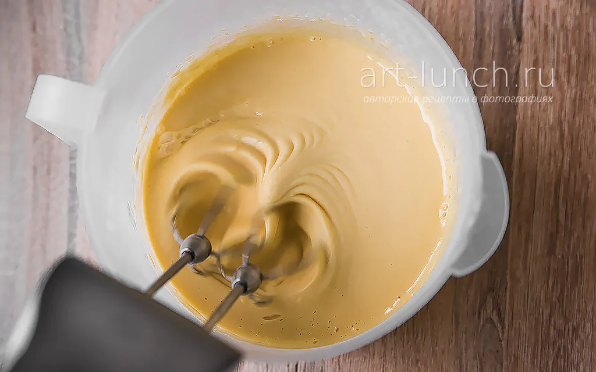
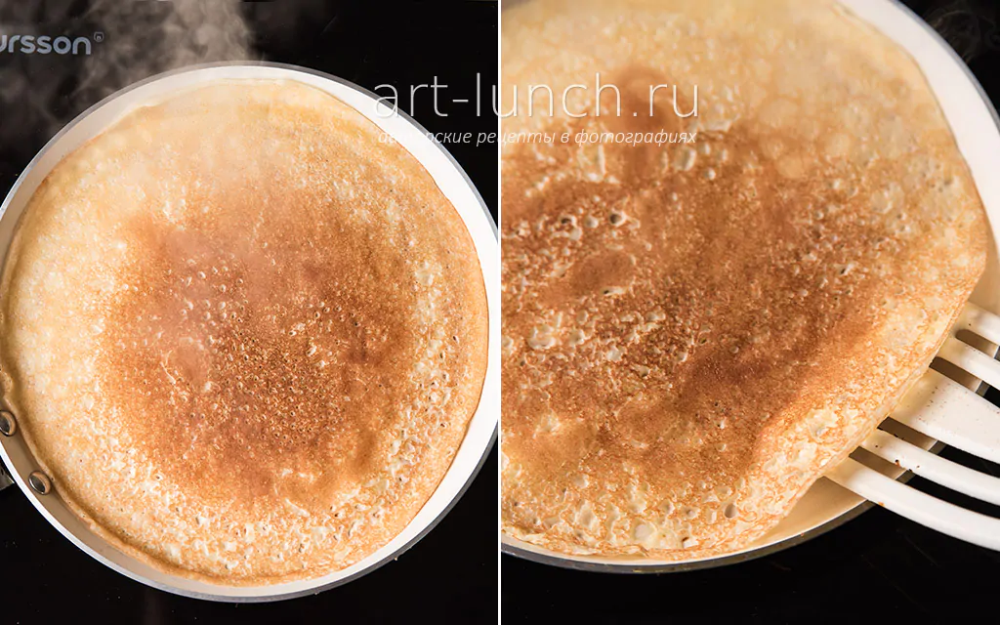

Ингредиенты:
- Яйца куриные: 2-3 штуки  
- Молоко: 300-400 мл  
- Мука: 100-150 гр / на глаз  
- Сахар, соль по вкусу  

1. Разбейте яйца, добавьте соль и сахар и немного молока  

2. Хорошо размешайте  

3. Помешивая, понемногу добавляйте муку, чтобы появлялось меньше комочков. Тесто может быть довольно густым, это нормально  

4. Влейте оставшееся молоко и хорошо размешайте  

5. Разогрейте сковороду. Жарить можно на любом масле, а можно и без него, в зависимости от сковороды. Главное жарить на сильном огне и не отвлекаться, чтобы блины не пригорели  

6. Подавайте с любимой начинкой  
